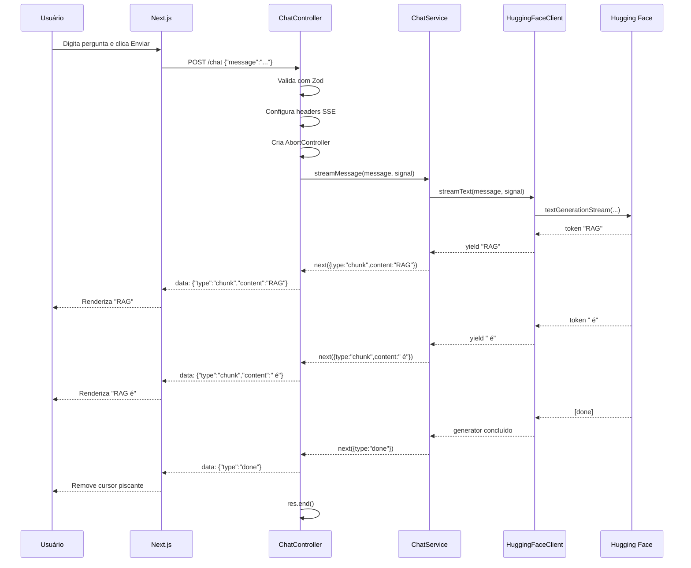
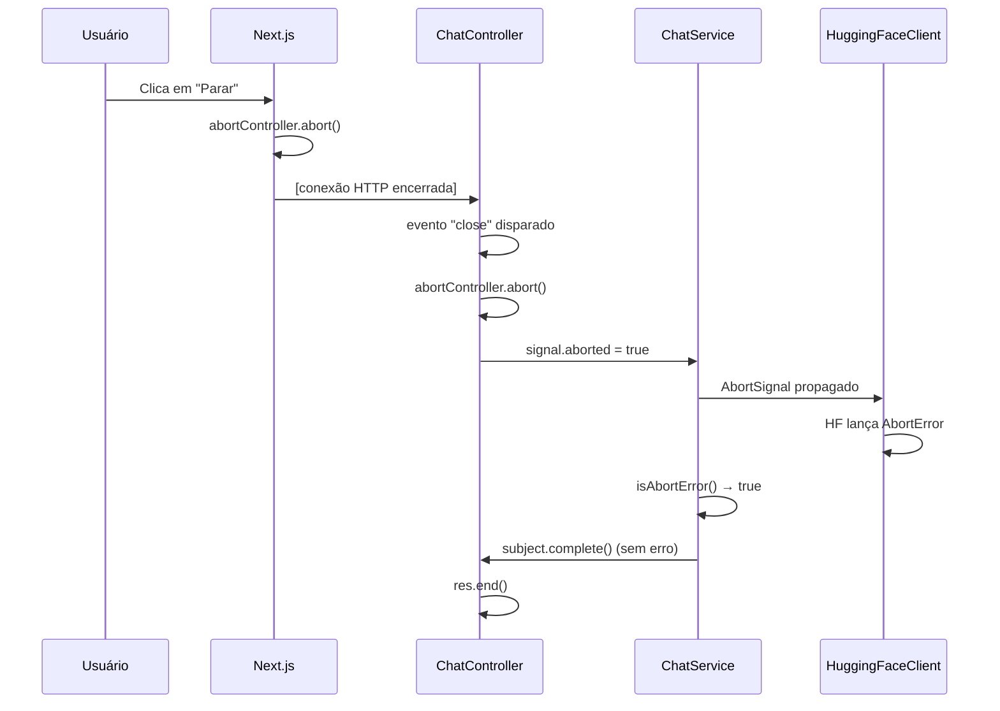

# Arquitetura

## Visão geral

O projeto é composto por dois serviços independentes que se comunicam via HTTP:

```
┌─────────────────────┐         ┌─────────────────────┐         ┌─────────────────────┐
│      Next.js        │◄────────│       NestJS        │────────►│   Hugging Face      │
│   (web, :3000)      │   SSE   │    (api, :3001)     │ stream  │       API           │
└─────────────────────┘         └─────────────────────┘         └─────────────────────┘
```

## Frontend (Next.js)

Responsabilidades:
- Renderizar a interface de chat
- Gerenciar o estado das mensagens
- Iniciar e consumir o stream SSE
- Parsear eventos SSE e atualizar o estado React progressivamente
- Exibir erros de forma amigável
- Permitir cancelamento do stream

Estrutura relevante:
```
web/src/
├── app/page.tsx          # Página principal (composição dos componentes)
├── components/
│   ├── ChatWindow.tsx    # Lista de mensagens com scroll automático
│   ├── ChatMessage.tsx   # Renderização individual de mensagem
│   ├── ChatInput.tsx     # Textarea + botões Enviar/Parar
│   └── ErrorBanner.tsx   # Banner de erro dispensável
├── hooks/
│   └── useChat.ts        # Toda a lógica: estado, fetch, stream, cancelamento
├── lib/
│   └── sse-parser.ts     # Parse e validação dos eventos SSE recebidos
└── types/
    └── chat.ts           # ChatMessage, SseEvent
```

## Backend (NestJS)

Responsabilidades:
- Validar a entrada do usuário
- Orquestrar a comunicação com o Hugging Face
- Transmitir os tokens como eventos SSE
- Gerenciar erros de forma segura (sem expor internals)
- Detectar desconexão do cliente e cancelar o stream

Estrutura (Clean Architecture / Vertical Slice):
```
api/src/modules/chat/
├── presentation/
│   └── chat.controller.ts   # HTTP: valida request, configura SSE, subscreve Observable
├── application/
│   └── chat.service.ts      # Orquestra stream → Subject → Observable<SseEvent>
├── infrastructure/
│   └── huggingface.client.ts# Integração HF: AsyncGenerator de tokens
└── schemas/
    └── chat.schema.ts       # Validação Zod do input
```

### Fluxo de dependências

```
ChatController → ChatService → HuggingFaceClient
```

Cada camada conhece apenas a próxima. O controller não conhece o HF, o service não conhece Express.

## Fluxo de uma requisição



## Fluxo de cancelamento



## Decisões arquiteturais

### SSE via Express manual vs `@Sse()` do NestJS

O decorator `@Sse()` do NestJS é elegante mas não aceita `@Body()` em requisições POST. Como o protocolo SSE requer que a conexão seja iniciada com GET pelo spec, mas nosso caso de uso precisa transmitir a mensagem do usuário, optamos por gerenciar os headers SSE manualmente via `Response` do Express. Isso nos dá controle total sem adicionar complexidade.

### AsyncGenerator no HuggingFaceClient

A API `textGenerationStream` do `@huggingface/inference` já retorna um `AsyncIterable`. Encapsulá-lo em um `AsyncGenerator` no client torna o serviço independente da biblioteca — podemos substituir o provider sem alterar o `ChatService`.

### Subject + Observable no ChatService

O `ChatService` converte o `AsyncGenerator` em um `Observable<SseEvent>` via `Subject`. Isso permite que o `ChatController` use o padrão reativo do RxJS (`.subscribe()`) sem precisar conhecer os detalhes assíncronos do generator.

### Sem contexto de conversa

Cada mensagem é enviada ao modelo de forma independente. Isso mantém o projeto simples e didático. Adicionar contexto exigiria gestão de histórico no backend, que está fora do escopo deste projeto de referência.
